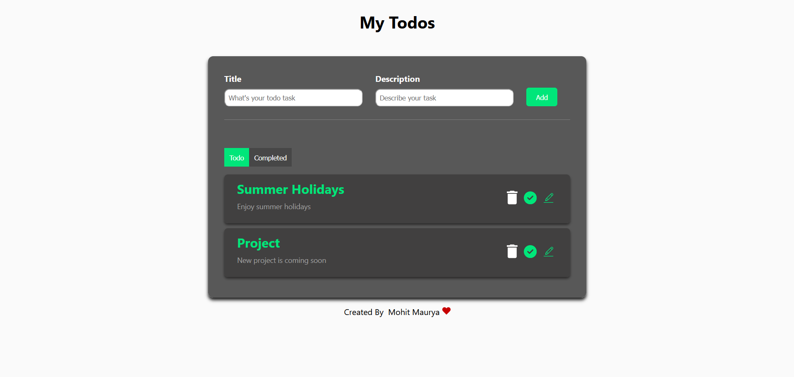
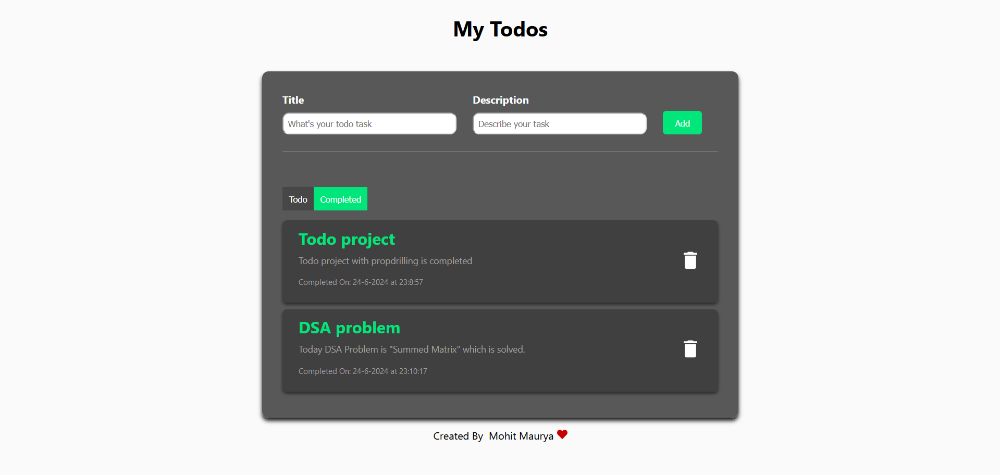

Here is the `README.md` file for your "My Todos" project:

````markdown
# My Todos

This is a To-do list app built on the front-end only where you can add your todo list title and write a brief description on it, and then add it to your list. This will go down in the todo section where you see three buttons: delete, complete, and edit your task. When you complete the todo task and click on the complete button, it will move down into the completed section where you can see your completed todo task, and from there you can also delete it. All tasks are stored in your local storage.

## Description

The My Todos project provides a simple and effective interface to manage your daily tasks. Users can add, edit, complete, and delete tasks. Completed tasks are moved to a separate section, making it easy to track progress. All tasks are stored in the local storage, ensuring persistence across sessions.

## Installation

Very simple to install:

1. **Clone the repository:**
   ```sh
   git clone https://github.com/yourusername/my-todos.git
   ```
2. **Navigate to the project directory:**
   ```sh
   cd my-todos
   ```
3. **Install the dependencies:**
   ```sh
   npm install
   ```
4. **Install React Icons:**
   ```sh
   npm install react-icons --save
   ```
5. **Install React Router DOM:**
   ```sh
   npm install react-router-dom@6
   ```
6. **Run the project:**
   ```sh
   npm run start
   ```

## Usage

1. **Add Todos:**

   - Enter the title and a brief description of your todo task.
   - Click the add button to add it to your todo list.

2. **Manage Todos:**

   - **Delete:** Remove the task from your list.
   - **Complete:** Mark the task as complete and move it to the completed section.
   - **Edit:** Modify the task details.

3. **Completed Section:**
   - View your completed tasks.
   - Delete tasks from the completed section.

## Preview of the Project




## Contributing

Feel free to contribute to this project. Any improvements or suggestions are welcome!

## License

This project is open-source and available under the [MIT License](LICENSE).

## Contact Information

If you have any questions or need further information, feel free to contact me at mauryamohit138@gmail.com.
````

You can copy this content and save it as `README.md` in the root directory of your project on GitHub. Let me know if there's anything else you need!
